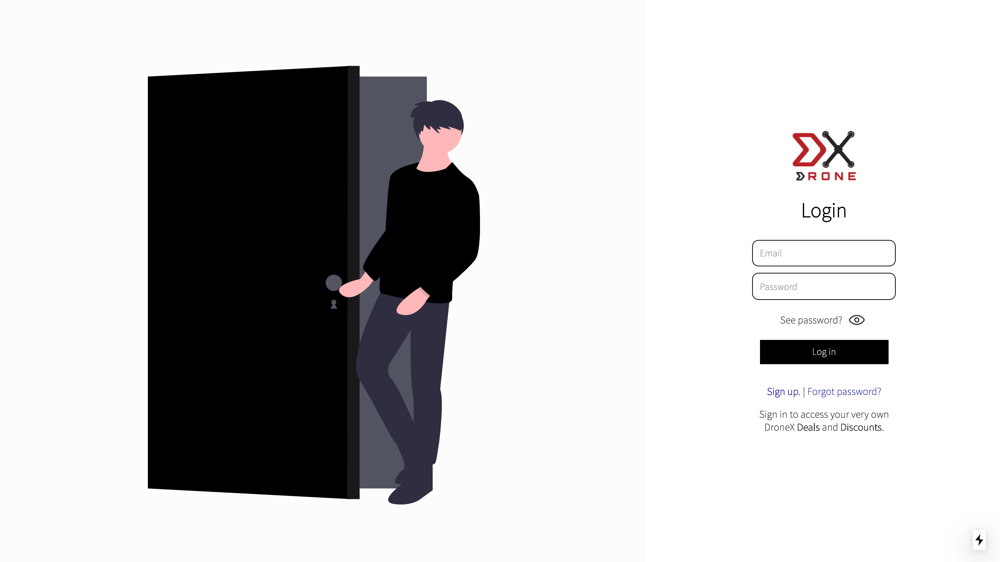
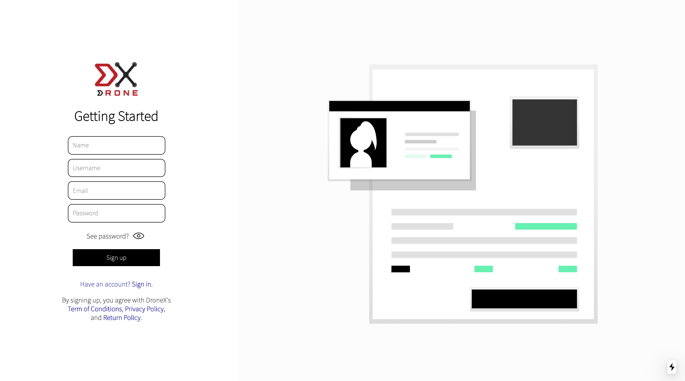
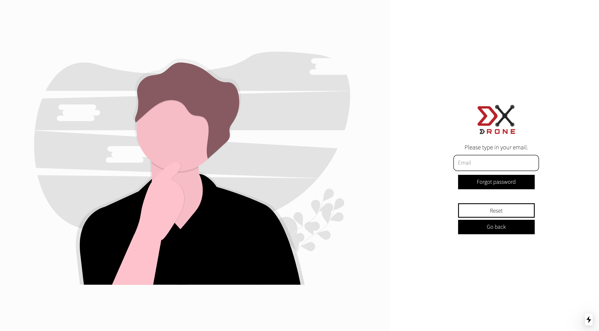
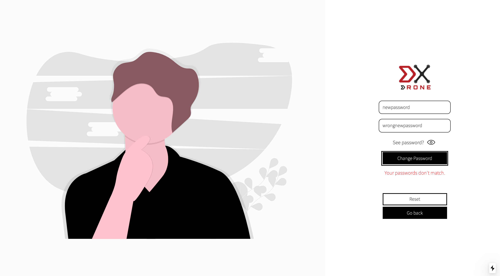
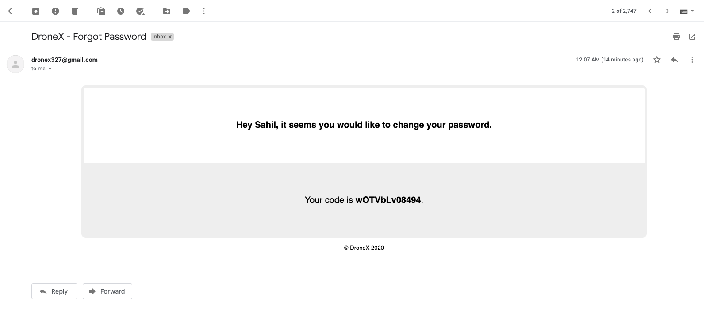

# DroneX

<!-- add the videos/gifs after -->

<h2>Intro</h2>

    DroneX is a complete web application aimed to be an e-commerce website selling the Mavic Air 2, a popular drone. When using the website, a user can create an account, "purchase" multiple drones, leave a review, use discount codes, share the product, and more!  

    <strong>
        *This is not a real website. The customer cannot input their credit card information or home address in the checkout process for safety purposes.
    </strong>

<h2>Features</h2>

<h3>Creating/Logging to an Account</h3>

    
    

Simply input the appropriate information, whether you are logging in or signing up. The user can click on the eye below the inputs to toggle seeing the password or not.

<!-- video goes here -->

<h3>Changing your Password</h3>

<!-- video goes here -->

If the user clicks on "Forgot password?" on the sign in page, they will be lead to another page to fill out information for forgetting the password.

<ol>
    <li>Input the email associated with your account.
    <li>Check your email for an email from DroneX(dronex327@gmail.com) giving the temporary code to confirm your account.
    <li>Input that code into the new input and submit.
    <li>Finally, input your new password into both the two inputs, for password confirmation, submit your form, and wait to be redirected back to the sign in page. 
</ol>

<h3>Home Page</h3>
<!-- video goes here -->

<h3>Leave a Review</h3>
<!-- video goes here -->

Click on "Leave a review" to go to the page with a form to fill out. Simply select the rating, leave a text, select an image or video, and even choose to post a review anonymously so no one can see your name.

<h3>Share the Product</h3>
<!-- video goes here -->

On the home page, the user can input the email of a person who does not already have an account with DroneX. This will automatically send an email to the new potential user inviting them to DroneX and letting them who shared the product with them. Once he/she has done so, not only will the new friend get emailed a unique one-time discount worth 15% off, the user who shared the product will also be emailed a one-time discount code worth 15% off as a thank you.

<h3>Use Discount Codes</h3>
<!-- video goes here -->

Upon the cart page, the user can input either the discount code already inputted for them or a unique discount they obtained through an email. This will reduce the total cost by how much ever percent the discount code reduces the price by.

<h3>Purchase a Mavic Air 2</h3>
<!-- video goes here -->
